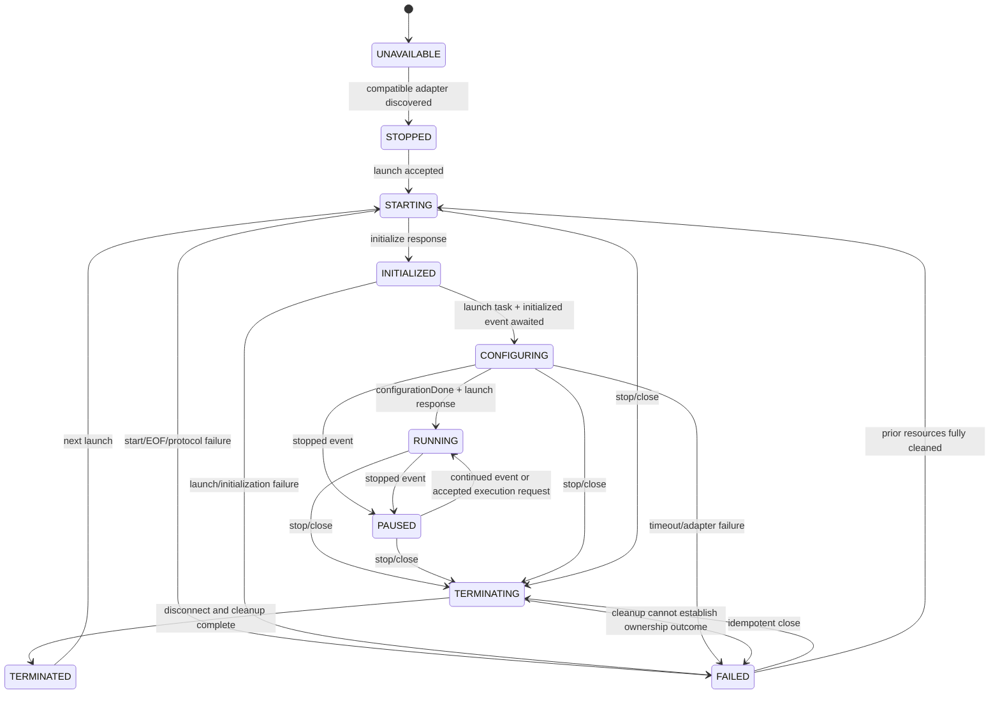

# ADR 0009: Use a transport-neutral DAP client, managed debugger plugin, and a constrained LLDB-DAP launch MVP

## Context

ForgeMCP has an application-scoped Workspace service, a policy-controlled
Process Runtime with streaming `ProcessHandle` objects, and transport-neutral
feature plugins.  It does not yet have a debugger.  Debug Adapter Protocol
(DAP) is superficially similar to LSP because both use JSON framed by
`Content-Length`, but it is not JSON-RPC and has a materially different
lifecycle: the adapter may launch a debuggee, emit state-changing events,
request work from its client, and outlive or lose the debuggee independently.
The existing LSP transport must therefore not be reused.

Debugging is also a stronger trust boundary than code navigation.  Launching a
workspace executable deliberately executes project code; attaching affects an
already-running process; evaluation can execute target code; and stack,
variable, memory, module, source, and output data can expose credentials or
other secrets.  A debug adapter is a trusted, policy-approved external
executable, but its DAP messages are still untrusted input.

The goal is an implementation-ready Phase 1 that can debug a source-built
Windows executable without making ForgeMCP a generic DAP proxy, a terminal
broker, an arbitrary debugger-command executor, or a symbol-download client.

### Investigated backends

The investigation uses read-only filesystem discovery and fixed `--help`/`--version`
probes only; it never copies an adapter into this repository. Phase 0 also performs
a controlled adapter-process start/close through Process Runtime. An opt-in,
test-local gate sends fixed `initialize` and `disconnect` messages only; it is not a
DAP client, exposes no production transport, and never launches a debuggee.
The DAP protocol itself specifies stdin/stdout single-session and optional
TCP multi-session modes, but ForgeMCP uses only the former for the MVP
([DAP overview](https://microsoft.github.io/debug-adapter-protocol/overview)).

On the development host, no candidate is on `PATH`. The following files were
found and checked read-only:

- Standalone LLVM `C:\Program Files\LLVM\bin\lldb-dap.exe` returns
  `lldb-dap version 22.1.8` with exit code 0 in its scrubbed environment. It
  passes required Job Object ownership, controlled start/close, and the
  opt-in test-only stdio `initialize`/`disconnect` probe. It is the accepted
  Phase-1 adapter prerequisite for this host; it is not an MSVC/PDB or
  PE/COFF+DWARF debuggee compatibility claim.

- `lldb-dap.exe` in both Visual Studio 2022 and Visual Studio 18 Community
  LLVM x64/ARM64 toolchain directories.  The x64 executable currently exits
  with Windows status `0xC0000135` before producing `--version` or `--help`;
  it is **discovered but unavailable**, not an MVP-ready installation.
- `OpenDebugAD7.exe` in the installed `ms-vscode.cpptools` extension.  Its
  `--help` runs and identifies it as the Visual Studio debug-engine bridge,
  with `--server`, tracing, and diagnostic-log flags.  It does not offer a
  version flag.  This proves only that the extension-local executable starts.
- No CodeLLDB adapter, GDB, or WinDbg DAP adapter was found in normal toolchain,
  VS Code-extension, Windows Kits, MSYS2, MinGW, Chocolatey, or WindowsApps
  locations.  The Windows Kits Debuggers directory exists but did not contain
  a DAP adapter.

### Phase-0 qualification update

`FORGEMCP_LLDB_DAP` is now a declarative absolute-path configuration candidate;
it is not an MCP input and does not by itself authorize execution. The internal,
transport-neutral `LldbDapQualifier` discovers it first, then PATH, standalone
LLVM, Visual Studio LLVM, VS Code LLVM/CodeLLDB locations (read-only), and
other known local LLVM locations. Every candidate is exact-approved as an
existing non-link regular executable, launched with Process Runtime's required
tree ownership and scrubbed environment, probed with fixed `--version`/`--help`,
then started and closed. `AdapterQualification` records only parsed/safe
metadata and distinguishes runnable process facts from unverified DAP and
debug-format capabilities.

On this host the final strict probe accepts the standalone LLVM adapter above.
The four Visual Studio LLVM files below are discovered but rejected:

- Visual Studio 2022 Community: `x64\bin\lldb-dap.exe` exits with loader
  status `0xC0000135`; its bounded read-only PE-import diagnostic identifies
  `liblldb.dll` as absent from the executable, approved companion directories,
  and Windows system directory. The ARM64 binary cannot start on this x64 host.
- Visual Studio 18 Community: `x64\bin\lldb-dap.exe` has the same missing
  `liblldb.dll` loader diagnostic; its ARM64 binary cannot start on this host.

The inspected Visual Studio LLVM toolchain directories contain no `liblldb.dll`.
The qualifier did construct the smallest permitted PATH from the adapter and
installed companion directories; it did not copy DLLs, alter Visual Studio, or
inherit a Developer Shell. Therefore these files are unavailable, not a usable
fallback backend. The accepted standalone adapter has a test-only
`initialize`/`disconnect` result; no PE/COFF, DWARF, MSVC/PDB, launch, or
debuggee capability is claimed until its respective real-adapter gate passes.

The matrix distinguishes an adapter's upstream capability from a ForgeMCP
promise.  `yes*` means capability discovery plus a real adapter integration
test are required before exposing the related tool.  `no` means intentionally
outside the indicated backend choice.  `S/V/E/M/D` abbreviates source
breakpoints, variables, evaluate, read/write memory, and disassembly.

| Candidate | Formats and debug information | Launch / attach and normal invocation | S/V/E/M/D | Terminal and portability | License / distribution / dependency | Decision |
| --- | --- | --- | --- | --- | --- | --- |
| **LLVM `lldb-dap`** | Native LLDB target support: PE/COFF on Windows and ELF/Mach-O elsewhere; DWARF is the primary portable path. LLDB has PDB readers, including a Windows DIA reader when built with DIA, but MSVC/PDB behaviour must be version-and-toolchain gated rather than assumed ([LLDB settings](https://lldb.llvm.org/use/settings.html)). | Start the approved absolute path as `[lldb-dap]` and speak DAP over stdio; no caller-supplied adapter argv. `launch` accepts `program`, `args`, `cwd`, `env`, `stopOnEntry`; `attach` exists, but is not MVP ([LLDB-DAP configuration](https://lldb.llvm.org/use/lldbdap.html)). | `yes*` for all: upstream documents modules, read/write memory and disassembly, as well as configuration, source/function breakpoints and hover evaluation. | `console=internalConsole` is usable; integrated/external terminals and deprecated `runInTerminal` are rejected. Windows, Linux, and macOS where a compatible standalone binary is installed. | LLVM/LLDB is Apache-2.0 with LLVM exception; official LLVM release packages contain prebuilt `lldb-dap`. No IDE extension is needed. Do not bundle it in ForgeMCP. | **Primary MVP backend.** Require a compatible, independently runnable absolute path and a real Windows toolchain gate (baseline MinGW/LLVM DWARF; every PDB claim gets its own gate). |
| **Visual Studio Windows debugger via `cppvsdbg` / `OpenDebugAD7`** | Windows PE/COFF and MSVC PDB are its native scenario; Microsoft documents `cppvsdbg`, `symbolSearchPath`, PDB source matching, dump support, and Natvis ([C++ debug configuration](https://code.visualstudio.com/docs/cpp/launch-json-reference)). MinGW/DWARF is not its primary `cppvsdbg` target. | Start the extension-local executable as `[OpenDebugAD7.exe]` over stdio; never use its optional `--server` TCP mode. Its `cppvsdbg` launch schema supplies `program`, args, cwd, environment, console, and attach. | `S/V/E: yes*`; modules/memory/disassembly must be capability-probed and specifically tested before Phase 2. | `internalConsole`, VS Code integrated terminal, and external windows are extension behaviours. Windows only. | The extension is Microsoft-licensed and its local license restricts it to use with Microsoft development products and prohibits standalone sharing. A compatible installed extension is required; ForgeMCP may discover it only from an explicit operator-approved path and must never redistribute it. Full Visual Studio IDE is not a required architecture dependency, but the extension/runtime is. | **Additional Windows backend, post-MVP.** Best route for a deliberate MSVC/PDB support tier, but not a distributable default. |
| **CodeLLDB** | LLDB-based; practical DWARF support for native C/C++/Rust and Windows x64 host support. PDB follows the bundled LLDB build and is not a ForgeMCP promise. | A version-pinned extension normally owns the adapter (commonly its `adapter/codelldb` executable) and bundled LLDB; a future backend may start the approved adapter over stdio with no MCP argv. It supports launch and attach, but its manual exposes LLDB command lists, remote setup, and terminal/RPC helpers. | `S/V/E/M/D: yes*`; upstream advertises memory, modules, and disassembly. | Strong integrated/external-terminal and remote features conflict with the MVP policy. Windows x64, Linux, macOS. | CodeLLDB source is MIT, but the extension/bundled native components still need a per-release provenance and notices review. A VS Code extension install is normally required ([CodeLLDB repository](https://github.com/vadimcn/codelldb)). | Not installed; defer. Its broad command and terminal surface makes it a poor first safe adapter. |
| **GDB DAP / a GDB DAP adapter** | ELF + DWARF is the main path. A suitable native Windows GDB can debug PE/COFF/MinGW-DWARF, but PDB is not a support target. | Prefer fixed `[gdb, --nx, --nh, --interpreter=dap]` (built with Python) over wrapping MI; disable auto-load again through fixed backend policy if the tested GDB version needs it. It supports adapter-defined launch/attach `program`, args, cwd, and env ([GDB DAP manual](https://www.sourceware.org/gdb/current/onlinedocs/gdb.html/Debugger-Adapter-Protocol.html)). The installed C/C++ extension can alternatively mediate `cppdbg`/MI, but this requires extension-local policy and has many unsafe setup-command options. | `S/V/E/M/D: yes*`; its DAP manual documents disassembly and warns that `evaluate` in REPL can execute CLI commands or continue the inferior. | Standard DAP stdio is portable where GDB exists. Do not support its shell/MI setup commands or terminal route. | GPLv3; redistributing a GDB binary has corresponding obligations. No candidate installed. | Future DWARF-focused backend; not a Windows PDB solution and not Phase 1. |
| **WinDbg / hypothetical WinDbg DAP** | WinDbg itself supports Windows user/kernel targets, PE/PDB, dumps, memory, and disassembly. | Official documentation found only WinDbg GUI/CLI/debug-server startup, not a supported standalone stdio DAP adapter ([WinDbg startup options](https://learn.microsoft.com/windows-hardware/drivers/debuggercmds/windbg-command-line-preview)). | Not applicable: no verified DAP implementation. | Windows only; terminal/remote/debug-server mechanisms are not DAP. | Microsoft distribution and SDK terms would require separate review. No adapter installed. | Excluded until Microsoft ships and documents a supported DAP adapter. |

`lldb-dap` is selected because it has a direct, documented DAP executable,
supports a stdio session without an IDE extension, is portable, and offers the
full source-debugging path.  This is not a claim that every build of
`lldb-dap` works with every MSVC PDB.  Phase 1's default Windows compatibility
target is **PE/COFF built with a compatible LLVM/MinGW DWARF toolchain**.  A
specific MSVC/PDB configuration is supported only after its exact adapter,
LLDB, Windows, compiler, linker, and PDB combination passes the required
real-adapter gate.  `OpenDebugAD7` is the planned optional Windows PDB backend.

## Decision

Create two new feature packages when implementation begins:

```text
src/forgemcp/dap/
    __init__.py
    transport.py
    protocol.py
    client.py
    errors.py

src/forgemcp/debugger/
    __init__.py
    models.py
    service.py
    plugin.py
    errors.py
    backends/
        __init__.py
        base.py
        lldb_dap.py
        open_debug_ad7.py       # later, Windows-only
```

There will be no DAP, LLDB, GDB, Visual Studio, FastMCP, `Path`, or
`ProcessHandle` type in `forgemcp.debugger.models`.  The DAP package receives
only byte streams and has no Core, Workspace, Process Runtime, or MCP import.
The debugger package is the only layer that joins Workspace, Process Runtime,
DAP, backend rules, and normalized models.

### Module responsibilities and public service boundaries

`forgemcp.dap.transport` owns byte framing only:

- read exactly one ASCII header block and one UTF-8 JSON payload;
- require exactly one decimal `Content-Length`, reject duplicate/unknown
  malformed headers, NUL, invalid UTF-8, trailing framing ambiguity, and a
  body above **1 MiB**; bound headers to **8 KiB**; and
- frame one already-validated mapping without logging its payload.

`forgemcp.dap.protocol` owns internal wire validation and typed internal
records (`DapRequest`, `DapResponse`, `DapEvent`, `DapCapabilities`).  It
validates required `seq`, `type`, `command`/`event`, `request_seq`, and
`success` fields before routing.  It does not normalize adapter-specific
arguments and never exposes a raw payload outside `dap`/`debugger` adapters.

`forgemcp.dap.client.DapClient` is an async, concurrent, client-side DAP
connection.  Its intended API is:

```python
class DapClient:
    def __init__(
        self,
        reader: asyncio.StreamReader,
        writer: asyncio.StreamWriter,
        *,
        event_handler: Callable[[str, Mapping[str, object]], Awaitable[None]] | None = None,
        reverse_request_handler: Callable[[str, Mapping[str, object]], Awaitable[Mapping[str, object] | None]] | None = None,
        default_timeout_seconds: float = 15.0,
        max_message_bytes: int = 1_048_576,
    ) -> None: ...

    async def start(self) -> None: ...
    async def request(
        self, command: str, arguments: Mapping[str, object] | None = None, *,
        timeout_seconds: float | None = None,
    ) -> Mapping[str, object]: ...
    async def cancel(self, request_seq: int) -> None: ...
    async def aclose(self, *, expected_eof: bool = False) -> None: ...
```

`DapClient` assigns a monotonically increasing positive outbound `seq` to
both client requests and replies to reverse requests.  A response is matched
by its `request_seq` **and expected command**, not arrival order.  Its sole
reader task routes responses to a pending-future table, publishes events
through a bounded queue, and passes reverse requests to fixed workers.  A
single writer lock encloses write plus `drain`, so frames cannot interleave.
Read-only DAP requests may be concurrent; service policy, not the transport,
decides which requests are allowed at a particular debugger state.

Timeout or caller cancellation removes the pending future and sends one
best-effort DAP `cancel` only when the adapter advertised cancellation.  A
late response is discarded and counted without emitting its content; a response
for a different pending command is a structural protocol failure.  Malformed
wire data, structural protocol violations, writer failure, or unexpected EOF
atomically fails the client and every pending/reverse task with a safe
`DapProtocolError` or `DapConnectionClosedError`; a well-formed unsuccessful
DAP response becomes a bounded `DapRequestError`, and a deadline becomes
`DapRequestTimeoutError`.  At most 16 unnormalised events and 8 reverse
requests are retained while four reverse handlers run; saturation is a bounded
protocol failure rather than unbounded task/payload retention. Each reverse
response has a ten-second deadline. A failure closes adapter stdin and tears
down workers; an expected EOF after shutdown is terminal but not an
adapter-crash diagnostic. `aclose()` is idempotent and never waits on the
reader from inside the reader task.

The client accepts only two reverse request command names:

- `runInTerminal` — advertise `supportsRunInTerminalRequest=false`; if an
  adapter nevertheless asks, reply `success=false` with a generic policy
  error.  The MVP has no terminal/process-tree broker, so accepting it could
  launch a debuggee outside Process Runtime's Job Object or with a shell.
- `startDebugging` — advertise `supportsStartDebuggingRequest=false` and deny
  it.  Nested configurations could otherwise create unvalidated executable,
  adapter, environment, and lifecycle paths.

Every other reverse request receives a bounded unsupported response.  The
consequence is intentional: interactive console input, terminal-dependent
programs, compounds/nested sessions, and adapters that require either reverse
request are unavailable in Phase 1.  The adapter backend must choose an
internal-console/stdout route or be marked incompatible.

`forgemcp.debugger.backends.base.DebugAdapterBackend` is a small, internal
adapter boundary.  It must have no MCP dependency and may not construct a
process directly:

```python
class DebugAdapterBackend(Protocol):
    backend_id: str

    async def discover(self) -> DebugAdapterInfo: ...
    def adapter_argv(self, adapter: DebugAdapterInfo) -> tuple[str, ...]: ...
    def initialize_arguments(self) -> Mapping[str, object]: ...
    def launch_arguments(self, request: DebugLaunchRequest) -> Mapping[str, object]: ...
    def attach_arguments(self, request: DebugAttachRequest) -> Mapping[str, object]: ...
    def normalize_capabilities(self, value: Mapping[str, object]) -> DebugCapabilities: ...
    def normalize_source(self, value: Mapping[str, object]) -> DebugSource: ...
```

It performs discovery/version parsing, fixed adapter argv, supported launch
argument construction, and adapter quirks only.  It cannot choose a path from
an MCP request, accept `initCommands`/`setupCommands`, start a process, own
session state, or map raw DAP records to an MCP result.  `LldbDapBackend`
uses fixed stdio invocation and sends only `program`, `args`, `cwd`, `env`,
`stopOnEntry`, and `console="internalConsole"` when that tested adapter
version supports it.  It never passes LLDB command arrays, source maps,
remote targets, `stdio` redirections, or arbitrary adapter args.

`DebuggerService` is application-scoped and receives only the declared
`WorkspaceService`, `ProcessRuntime`, configuration/policy, logger, and a
registry of built-in backends.  It owns the one-session slot, state machine,
policy validation, adapter `ProcessHandle`, `DapClient`, process watcher,
stderr drain, event buffer, capability gating, opaque handles, coordinate/path
conversion, and safe domain errors.  It is the only DAP-to-model
normalization boundary.

Its public API mirrors normalized operations rather than DAP commands and
never accepts a raw request mapping:

```python
class DebuggerService:
    async def status(
        self, *, after_event_sequence: int | None = None, event_limit: int = 100
    ) -> DebugSessionStatus: ...
    async def list_adapters(self) -> tuple[DebugAdapterInfo, ...]: ...
    async def launch(self, request: DebugLaunchRequest) -> DebugSessionStatus: ...
    async def stop(self, session_id: str) -> DebugSessionStatus: ...
    async def set_breakpoints(
        self, session_id: str, request: SourceBreakpointSet
    ) -> tuple[DebugBreakpoint, ...]: ...
    async def continue_execution(self, session_id: str, thread_id: str | None = None) -> DebugSessionStatus: ...
    async def pause(self, session_id: str, thread_id: str | None = None) -> DebugSessionStatus: ...
    async def step_over(self, session_id: str, thread_id: str) -> DebugSessionStatus: ...
    async def step_in(self, session_id: str, thread_id: str) -> DebugSessionStatus: ...
    async def step_out(self, session_id: str, thread_id: str) -> DebugSessionStatus: ...
    async def threads(self, session_id: str) -> tuple[DebugThread, ...]: ...
    async def stack_trace(self, session_id: str, thread_id: str, *, start_frame: int = 0, levels: int = 100) -> tuple[DebugStackFrame, ...]: ...
    async def scopes(self, session_id: str, frame_id: str) -> tuple[DebugScope, ...]: ...
    async def variables(self, session_id: str, variables_handle: str, *, start: int = 0, count: int = 200) -> tuple[DebugVariable, ...]: ...
    async def evaluate(self, request: DebugEvaluateRequest) -> EvaluateResult: ...
    async def aclose(self) -> None: ...
```

Phase 2 extends this same service with models for modules, memory,
disassembly, mutation, restart, and explicitly enabled attach.  It does not
expose a generic `request(command, arguments)` escape hatch.

`DebuggerPlugin` is a built-in plugin with ID and capability `debugger` and
requires only `workspace` and `process_runtime`.  In `start()` it creates the
service and registers `ToolContribution`s; in `stop()` it awaits
`DebuggerService.aclose()`.  It receives no `FastMCP` and exposes no raw DAP
or backend object.  Plugin Manager's existing reverse shutdown order already
closes it before Process Runtime.

### Session state machine

The service retains terminal status for diagnostics; it does not automatically
restart an adapter.  `UNAVAILABLE` means no policy-approved runnable adapter,
not merely no active session.  `STOPPED` means an approved adapter is
available and there is no active session.



The DAP ordering is fixed: start the adapter through Process Runtime; create
and start `DapClient`; issue `initialize` with native path format and
ForgeMCP's 0-based lines/columns; validate capabilities; issue `launch` as a
pending request; wait for `initialized`; replace source breakpoint sets for
the supplied initial breakpoint groups; send `configurationDone` only when the
adapter explicitly advertises `supportsConfigurationDoneRequest`; then await
the launch response.  The public `launch` input includes initial breakpoints
because a stateless MCP caller otherwise has no tool between `initialized` and
`configurationDone`.  Later `set_breakpoints` replaces the full set for one
source while running or paused.

`stopped`, `continued`, `exited`, and `terminated` are events, not substitutes
for a pending response.  A `stopped` event during configuration makes the
state `PAUSED` after configuration completes.  `exited` records a bounded exit
code/event; `terminated` releases the session.  The adapter process and the
debuggee are distinct: `ProcessHandle.pid` is never presented as a debuggee
handle, and an adapter-reported process ID is metadata only.  If the adapter
crashes, `ProcessHandle.wait()` closes the required Windows Job Object or the
owned POSIX group before the watcher reports `FAILED`, so normal descendants
are terminated. This is a containment guarantee for the owned tree, not a
claim that an OS crash or an intentionally escaping trusted process can be
recovered or contained absolutely.

Before any continue, step, restart, stop, or forced close is sent, the service
closes the current stopped-data epoch and cancels pending stopped-data reads.
This is deliberately conservative: if the execution request later fails, the
client refetches threads/stack/scopes rather than trusting a race-prone handle.
`pause` is valid while `RUNNING`; read requests are rejected until a `stopped`
event.  At most one active debug session exists per `ForgeApplication` in the
MVP; a second launch receives `debugger_session_active`. `stop` pre-empts a
pending `STARTING` or `CONFIGURING` launch by cancelling that operation before
waiting for the session lock, so an unresponsive configuration request cannot
retain the owned process tree past the bounded close path.

Close is idempotent and begins by setting `TERMINATING`, blocking new work,
cancelling non-close requests, and invalidating handles.  For a launched
debuggee it attempts `disconnect(restart=false, terminateDebuggee=true)` in a
short bounded interval; for future attach it will use
`terminateDebuggee=false`.  It then closes DAP streams, waits briefly for the
adapter, asks `ProcessHandle.terminate()`, and uses `kill()` if needed.  A
Process Runtime strong-tree-ownership result is required before advertising a
launched session as safely controllable on Windows (see below).

### Trust, source, and launch policy

The Phase 1 contract is explicitly for a project and binaries the operator
trusts to execute.  It is not an OS sandbox.

| Boundary | Policy |
| --- | --- |
| Launch | Enabled. Validate the executable and CWD as workspace-relative, existing, non-symlink locations under an explicit build-tree allow-list (for example `build`, `build-*`, `cmake-build-*`), not merely anywhere on `PATH`. The executable may be an `.exe` only on Windows. Validate up to 64 NUL-free arguments and pass them as an array, never through a shell. |
| Attach | Deferred to Phase 2 and disabled by default even then. It needs a separate operator capability, PID validation, elevation/error semantics, and an explicit detach-versus-terminate policy. |
| Adapter discovery | No MCP path/argv input. A future declarative configuration contains exact absolute approved adapter paths, expected backend IDs, optional pinned version ranges/hashes, and allowed environment keys. Discovery may check those paths and run a fixed `--version`/`--help`; it never recursively trusts IDE or extension directories by default. |
| Environment | The debuggee receives only a bounded explicit override mapping whose keys are allow-listed by policy; values are never logged. The adapter starts from a scrubbed, minimal environment that removes symbol/network configuration such as `DEBUGINFOD_URLS` and `_NT_SYMBOL_PATH` unless a future policy allows them. This requires a runtime/configuration change. |
| Debugger commands | No arbitrary adapter args, LLDB `*Commands`, GDB setup commands, source maps, remote endpoints, shell, terminal, or file descriptor redirection. |
| Symbols and sources | Disable auto-download/network symbol or source lookup. A workspace source is returned only after `WorkspaceService.validate_reported_path`; an external source may supply bounded display metadata, never a path ForgeMCP will read, open, or treat as workspace-contained. A backend may be configured to omit external-source metadata entirely. |
| Evaluate and variables | Values, stack, variables, modules, memory, output, and expressions are sensitive egress and never enter logs. Phase 1 sends evaluate only as DAP `hover` in a current frame, never `repl`, `watch`, `clipboard`, or a debugger-command context. Its accepted grammar is one ASCII identifier; member/index/dereference syntax is rejected because overloaded C++ operations are not semantically read-only. Even an identifier lookup can have side effects in native debuggers, so the result is labelled `side_effects_possible`; variables/scopes remain the primary read-only inspection route. |
| Mutation | `setVariable`, `writeMemory`, `setExpression`, `restart`, and attach are separate capabilities and Phase 2 only. They never ride on a broad `evaluate` permission. |
| Adapter messages | Treat all incoming DAP fields as malformed until validated, capped, and normalized. Do not log raw DAP, adapter stderr, raw source paths, launch argv, environment values, variable values, or memory. |

The official DAP model deliberately lets adapters define launch and attach
arguments and lets `runInTerminal` move launching into the client.  ForgeMCP
therefore constructs the tiny backend-owned argument set itself rather than
forwarding an adapter configuration ([DAP launch model](https://microsoft.github.io/debug-adapter-protocol/overview)).

### Opaque handles and stopped-data lifecycle

Native DAP integers and strings are not public identifiers.  The service
creates 256-bit random opaque tokens and stores only a bounded internal record:

```text
application_nonce, session_nonce, kind, stop_generation?, native_id/ref,
created_monotonic, last_access_monotonic, small metadata
```

The resolver validates application/session ownership, token kind, expiration,
capacity, and (where applicable) the current stop generation before exposing
the internal native value.  It returns one safe `debugger_handle_expired`
error for unknown, cross-kind, cross-session, evicted, expired, or stale
tokens; it never reveals which test failed.

| Handle kind | Binding and invalidation | TTL / bounded cache |
| --- | --- | --- |
| Session | Application and active session. It is not usable after terminal cleanup. | Active lifetime; retain terminal status separately, not a usable handle. |
| Thread | Application + session. DAP thread IDs may survive continue, so do not bind them to a stop generation; refresh them on every `threads` call and invalidate on session end. | 5 minutes since last use; 256. |
| Breakpoint | Application + session + source replacement generation; survives a normal stop/continue but not replacement for its source, restart, or session end. | 5 minutes; 1,024. |
| Frame, scope, variables reference, evaluation children, memory reference | Application + session + current stop generation. Clear before an execution-changing request and on every new stop/terminal event. | 2 minutes; frames 256, scopes 512, variable/evaluate refs 2,048, memory refs 256. |
| Module/source | Application + session; external paths remain metadata-only. Clear on adapter module invalidation, restart, or session end. | 5 minutes; 512 each. |

Each cached payload is capped at 8 KiB and maps to a single native ID/ref; no
raw DAP message is cached.  On every insertion, remove expired entries then
evict FIFO at the kind's capacity.  A stopped-data epoch is monotonically
incremented when stopped data becomes available and is closed before resume,
step, restart, stop, or crash.  This follows DAP's rule that frame/scope/
variable references are valid only in the current suspended state
([DAP object-reference lifetime](https://microsoft.github.io/debug-adapter-protocol/overview)).

### Transport-neutral models

All debugger models are immutable `ForgeModel` types in
`forgemcp.debugger.models`, reject unknown fields, use bounded strings and
collections, and contain no DAP payload.  Initial model shapes are:

| Model | Normalized public fields |
| --- | --- |
| `DebugAdapterInfo` | `backend_id`, display name, executable metadata (not an arbitrary path), availability, version, supported modes/capabilities, `requires_extension`, and a safe unavailable reason. |
| `DebugSessionStatus` | opaque `session_id` when active, state, backend ID, mode, capabilities, stop generation, active-thread handle, last event sequence, dropped-output/event counters, adapter/debuggee termination confidence, and safe failure class/message. |
| `DebugThread` | opaque `thread_id`, bounded name, current state, and optional `is_current`. |
| `DebugStackFrame` | opaque `frame_id`, thread handle, frame index/name, optional normalized source, optional 0-based line/column, and opaque instruction reference only when Phase 2 allows it. |
| `DebugScope` | opaque `scope_id`, name, `expensive`, and opaque variable handle. |
| `DebugVariable` | name, bounded value/type/evaluate name/presentation hint, child variable handle, indexed/named child counts, and a truncation flag. |
| `DebugBreakpoint` | opaque breakpoint ID, workspace path, requested and verified 0-based positions, verified flag, bounded message, and source replacement generation. |
| `DebugStoppedReason` | normalized enum (`breakpoint`, `step`, `exception`, `pause`, `entry`, `function_breakpoint`, `data_breakpoint`, `instruction_breakpoint`, `unknown`), bounded description, and thread/all-thread status. |
| `DebugOutputEvent` | monotonically sequenced event, normalized category, text capped to 16 KiB, optional source metadata, and `truncated`; it is never log-safe. |
| `DebugModule` | opaque module ID, bounded name/version/address-range metadata, and normalized/omitted source metadata. |
| `DebugMemoryBlock` | opaque input reference, offset/count, base64 data capped at 64 KiB decoded, unreadable-byte count, and truncation. Addresses stay opaque strings. |
| `DisassembledInstruction` | opaque instruction address/reference, bounded instruction text/symbol, optional normalized source and 0-based location. |
| `EvaluateResult` | bounded result/type, optional child-variable handle, memory reference omitted in Phase 1, and `side_effects_possible=True`. |

`DebugSource` has `kind` (`workspace`, `external_metadata`, or `omitted`), a
workspace-relative `path` only for `workspace`, and bounded non-path name/origin
metadata otherwise.  DAP's `pathFormat`, `linesStartAt1`, and
`columnsStartAt1` are negotiated in `initialize`; the client sends 0-based
ForgeMCP coordinates only after converting to DAP at the backend boundary and
converts all returned source coordinates back to zero-based code-point
locations.  An adapter's line/column may be clamped only when explicitly
reported as a verified breakpoint; otherwise malformed coordinates are omitted.

### MCP-tool phases

All tools are `debugger__*` contributions.  Every schema has `session_id` for
an active-session operation even though the MVP permits exactly one; it makes
the application/session binding explicit and avoids an ambiguous future
multi-session contract.  `limit` values default below their maxima.  A
capability means both adapter-advertised and ForgeMCP-policy-enabled.

#### Phase 1 — lifecycle and source debugging

| Tool | Input schema and states | Capability / backend difference | Result limits, invalidation, safety |
| --- | --- | --- | --- |
| `debugger__status` | `{after_event_sequence?: int, event_limit?: 1..100}`; any state. | None; includes normalized adapters and bounded event delta. | At most 100 events / 256 KiB, with `next_sequence`, `dropped`, `truncated`; read-sensitive output. |
| `debugger__list_adapters` | `{}`; any state. | Discovery only; no adapter launch. | Bounded configured backend list and safe availability reason; low-risk metadata. |
| `debugger__launch` | `{adapter_id?, program, args?: [str], cwd?: str, environment?: map[str,str], stop_on_entry?: bool, initial_breakpoints?: [SourceBreakpointSet]}`; `STOPPED`/`TERMINATED`, or `FAILED` after cleanup. | Launch, configuration-done, source breakpoints; `lldb-dap` only initially. | 64 args, 32 env entries, 20 sources/100 breakpoints each. Creates session; no existing handles to invalidate. Executes project code. |
| `debugger__stop` | `{session_id}`; `STARTING` through `PAUSED`, `FAILED`, or terminal idempotently. | Disconnect; launched sessions request terminate-debuggee. | No raw errors; invalidates all handles and clears buffers after final status cursor. Destructive process control. |
| `debugger__set_breakpoints` | `{session_id, path, breakpoints:[{line,column?}]}`; `CONFIGURING`, `RUNNING`, `PAUSED`. | `setBreakpoints`; only workspace source. | 100 per source, full replacement semantics. Invalidates breakpoint handles for that source only. Mutates debuggee instrumentation but not files. |
| `debugger__continue` | `{session_id, thread_id?}`; `PAUSED`. | Continue; optional thread is honoured only if backend advertises safe single-thread execution, otherwise omitted. | Closes stopped epoch before send; all frame/scope/variables/memory handles stale. Executes code. |
| `debugger__pause` | `{session_id, thread_id?}`; `RUNNING`. | Pause required by core DAP session. | No immediate stopped-data promise; a `stopped` event creates next epoch. Changes debuggee execution. |
| `debugger__step_over` / `debugger__step_in` / `debugger__step_out` | `{session_id, thread_id}`; `PAUSED`. | `next` / `stepIn` / `stepOut`. | Same stopped-data invalidation as continue; execution control. |
| `debugger__threads` | `{session_id}`; `PAUSED` (or adapters that safely support threads while running are still rejected in MVP). | `threads`. | 256 threads; refreshes thread handles; sensitive names only. |
| `debugger__stack_trace` | `{session_id, thread_id, start_frame?: int, levels?: 1..100}`; `PAUSED`. | `stackTrace`; delayed loading only if advertised. | 100 frames; creates current-epoch frame handles; external source omitted/metadata-only. |
| `debugger__scopes` | `{session_id, frame_id}`; `PAUSED`. | `scopes`. | 64 scopes; creates current-epoch scope/variable handles. Sensitive. |
| `debugger__variables` | `{session_id, variables_handle, start?: int, count?: 1..200}`; `PAUSED`. | `variables`, paging only if adapter semantics permit. | 200 variables / 256 KiB serialized response; child handles current epoch. Sensitive. |
| `debugger__evaluate` | `{session_id, frame_id, expression, context?: "watch"|"hover"}`; `PAUSED`. | `evaluate` and policy `evaluate`; never REPL. | Expression 4 KiB; result 16 KiB, optional child handle current epoch. Potential side effects and secret disclosure. |

`SourceBreakpointSet` is a structured model, not a DAP object: its `path` is
workspace-relative and its line/column use ForgeMCP zero-based coordinates.
Conditions, hit conditions, log messages, function/exception/instruction/data
breakpoints, and source maps are intentionally absent from Phase 1 despite
some adapters supporting them.

#### Phase 2 — native inspection and mutation

| Tool | Input schema and states | Capability / backend difference | Result limits, invalidation, safety |
| --- | --- | --- | --- |
| `debugger__modules` | `{session_id, start_module?: int, module_count?: 1..100}`; `PAUSED`. | `supportsModulesRequest`; backend module IDs are opaque. | 100 / 256 KiB; module handles session-bound. Sensitive metadata. |
| `debugger__read_memory` | `{session_id, memory_reference, offset?: int, count: 1..65536}`; `PAUSED`. | `supportsReadMemoryRequest`; `lldb-dap` advertises it. | 64 KiB decoded; current-epoch references. Highly sensitive. |
| `debugger__disassemble` | `{session_id, instruction_reference, offset?: int, instruction_offset?: int, count: 1..500}`; `PAUSED`. | `supportsDisassembleRequest`; syntax/backend display differs. | 500 instructions / 256 KiB; external source policy applies. Sensitive binary disclosure. |
| `debugger__set_variable` | `{session_id, variables_handle, name, value}`; `PAUSED`. | `supportsSetVariable` plus explicit mutation policy. `lldb-dap` capability must be checked per version; the current upstream table says no. | Name/value up to 4 KiB; response invalidates current stopped epoch defensively. Mutates debuggee. |
| `debugger__write_memory` | `{session_id, memory_reference, offset?: int, data_base64}`; `PAUSED`. | `supportsWriteMemoryRequest` plus explicit mutation policy. | 64 KiB decoded; invalidates stopped epoch. High-risk process mutation. |
| `debugger__restart` | `{session_id}`; `RUNNING`/`PAUSED`. | `supportsRestartRequest`, only launched sessions, plus policy. | Invalidates all handles; must re-establish breakpoint/configuration behaviour per backend. Re-executes code. |
| `debugger__attach` | `{adapter_id?, pid, program?, initial_breakpoints?: [...]}`; `STOPPED`/`TERMINATED`. | `supportsAttach` plus explicit attach capability; only local PID, no remote/core/command forms. | Creates session and follows configuration flow; all handle semantics apply. High-risk interference; no termination on ordinary disconnect. |

Phase 2 is not automatically justified by a Phase 1 backend.  Each tool needs
adapter capability discovery, a compatible backend-specific integration test,
the declared policy capability, and threat-model review.  In particular,
`lldb-dap` advertises read/write memory and disassembly but its present
upstream capability table does not advertise `setVariable`; this is exactly
why ForgeMCP exposes neither merely because another backend does.

### Concurrency, events, and output

The service owns a `session_lock` for launch/close and an `execution_lock` for
mutating execution/configuration requests (`launch` setup, breakpoints,
continue/pause/step, restart, set-variable, write-memory, stop).  A mutating
request is linearized before the DAP request is sent.  Read-only requests
(`threads`, stack, scopes, variables, evaluate, modules, memory,
disassemble) may run concurrently only in `PAUSED`, capture the stop epoch on
entry, and verify it again before returning a result.  Thus a simultaneous
continue makes the read fail safely with `debugger_stopped_data_stale`, not
return a handle that already refers to resumed state.

The DAP reader never waits on the execution lock to accept an event.  It
updates minimal state under a short state lock, appends a normalized event,
then signals waiters.  A stopped event during a pending read opens a new epoch
only after the old reads are cancelled.  Terminate during evaluate first marks
closing, cancels the pending client request, and waits only for the bounded
disconnect path.

The event store is a ring of at most **256 normalized events or 512 KiB**,
whichever arrives first.  Each event receives an increasing per-session
sequence.  `status(after_event_sequence, event_limit)` returns events newer
than the cursor, the next cursor, and explicit `dropped`/`truncated` counts;
a cursor older than the retained head reports `dropped=true`.  Debuggee output
is normalized to `DebugOutputEvent`, retained under the same total bound, and
is not written to logs.  Adapter stderr is continuously drained to avoid a
pipe deadlock, counted up to 64 KiB, then discarded; raw stderr never becomes
an event. `debugger__stop` preserves one deduplicated normalized terminal event
for post-stop reads; a new session and full application shutdown clear the
event store. All handle caches clear on final close.

### Process Runtime Phase-0 completion and remaining admission criteria

The existing `ProcessHandle` is sufficient for basic DAP stdin/stdout/stderr:
it exposes `StreamWriter`/`StreamReader`s, provides wait/terminate/kill, and
is owned by Process Runtime.  The debugger must use it; it must not call
`subprocess` or `asyncio.create_subprocess_exec` directly.

Phase 0 closes the runtime prerequisites without adding a DAP transport or
debugger plugin:

1. **Required ownership is now observable.** `start_trusted_adapter` returns
   only after the Windows kill-on-close Job assignment succeeds (with no
   breakaway flags), or after POSIX session/process-group creation. Its handle
   exposes `required_ownership` and `ownership_established`. Job failure kills
   the unreturned direct process and raises `ProcessOwnershipError`; `taskkill`
   is retained only for ordinary best-effort callers.
2. **Exact adapter approval is enforced.** `ProcessPolicy` captures a
   canonical, case-aware Windows path and regular-file metadata at approval,
   rejects NUL/link/reparse paths, and rechecks it at launch. A bare-name
   allow-list cannot turn an adapter PATH lookup into an exact approval.
3. **Adapter environment is scrubbed.** It inherits no ForgeMCP environment
   (therefore no common secret, symbol, source-server, or Developer Shell
   variables), carries only an explicit bounded system-variable allow-list,
   and builds PATH from the exact adapter/approved companion directories.
   Debuggee environment remains a future DAP launch-policy payload.
4. **Qualification is deterministic and bounded.** Fixed `--version`/`--help`
   probes and a controlled start/close use only `run_trusted_adapter` and
   `start_trusted_adapter`; raw argv, environment, stderr, and probe output are
   not logged or returned through MCP.
5. **Tests cover the boundary.** Exact approval/replacement/PATH-spoof/link
   rejection, scrubbed environment/PATH, legacy caller behavior, strict
   adapter descendant cleanup, timeout/cancellation/idempotence, Windows Job
   assignment failure, and fake candidate qualification are regression-tested.

No safe `runInTerminal` broker exists.  Building one later would require a
separate ADR covering exact executable/cwd/env validation, console handles,
Windows Job assignment, stdin mediation, output limits, terminal lifecycle,
and the fact that a terminal may create a process outside the adapter tree.
It is not a small addition to `DapClient`.

The Phase 1 admission and implementation gates are now recorded as passed:

- fake-stream `DapClient` tests cover fragmented framing, out-of-order
  responses, reverse-request denial, timeout/cancellation, malformed JSON,
  EOF, sequential writing, and all pending-future cleanup;
- a fake DAP adapter launched only through Process Runtime covers state,
  event/race, handle-expiration, output/stderr, and close behaviour;
- a real independently installed `lldb-dap` stdio gate launches a
  workspace-contained minimal native binary, sets a source breakpoint, stops,
  lists threads/stack/scopes/variables, evaluates a watch expression, steps,
  and proves shutdown removes the adapter/debuggee tree; and
- the current host gate uses standalone LLVM 22.1.8 to compile a local
  `-O0 -g -gdwarf-4` PE/COFF executable, confirms `.debug_info` with
  `llvm-readobj`, and passes initialize, launch, source breakpoint, stopped,
  threads, stack/scopes/variables, safe hover evaluate, step, continue,
  disconnect, and process cleanup; and
- a real MCP stdio vertical slice passes tool listing, backend listing, launch,
  inspection, continue, event cursor reading, stop, and transport shutdown.

This passes exactly the installed LLVM/DWARF host combination. MSVC/PDB is an
additional compatibility claim only after an explicit passing gate; if it
requires `OpenDebugAD7`, it is tested under that optional backend and its
extension/license constraints.

## Consequences

The implementation gets a small reusable DAP client without coupling its
wire/state semantics to LSP, and a debugger plugin that fits the existing
PluginManager shutdown order.  The public tool surface is deliberately smaller
than a normal IDE: one session, launch-only, workspace build trees,
internal-console output, source breakpoints, paused-state inspection, and
watch/hover evaluation.

The cost is intentional.  Interactive stdin, external/integrated terminals,
attach, remote debugging, dump/core debugging, symbol/source download,
arbitrary backend configuration, terminal nesting, REPL commands, source
mapping, and process mutation are unavailable until separately designed.
The standalone LLVM 22.1.8 adapter now passes the strict process, production
DAP, PE/COFF + DWARF debuggee, and MCP vertical-slice gates on this host. The
Visual Studio-bundled copies remain unavailable and are not a fallback backend.

The implemented state machine is `UNAVAILABLE`, `STOPPED`, `STARTING`,
`INITIALIZED`, `CONFIGURING`, `RUNNING`, `PAUSED`, `TERMINATING`,
`TERMINATED`, and `FAILED`. The service waits for `initialized`, installs
initial source breakpoints, sends `configurationDone` only when the adapter
advertises it, then awaits the launch response so LLDB-DAP's configuration
sequencing cannot deadlock. `stop` cancels a pending start/configuration before
the bounded disconnect/tree cleanup. It sends
`disconnect(terminateDebuggee=true)` before closing the DAP transport and uses
the ProcessHandle fallback cleanup path.

Program, CWD, and breakpoint paths are workspace-relative; generated build
trees use the narrow validation-only execution-path capability. Debuggee
environment overrides are unavailable until an explicit key allow-list exists.
External sources are metadata-only/omitted and are never read. Native DAP IDs
are replaced by random typed TTL handles bound to application/session and,
for stopped data, stop generation; continued/step/stop/crash invalidates them.
Events use an in-session monotonic cursor and a bounded 256-event/512-KiB ring.
Evaluate is a hover-context single-identifier lookup only; LLDB command escape,
calls, assignment, semicolons, members, indexes, dereference, casts, comments,
and REPL contexts remain denied. This is not a claim that native evaluate is
side-effect-free; variables/scopes are the primary read-only inspection path.

Open questions retained for the implementation review are the exact supported
LLVM/LLDB version floor; the build-tree allow-list representation; which
minimal Windows environment variables a standalone adapter requires; whether
the service should retain terminal status by a non-usable historical ID; and
whether an operator-facing MSVC/PDB tier should use LLDB-DAP or the optional
Microsoft extension backend.  None of those questions authorizes a raw DAP or
adapter-argv passthrough.
